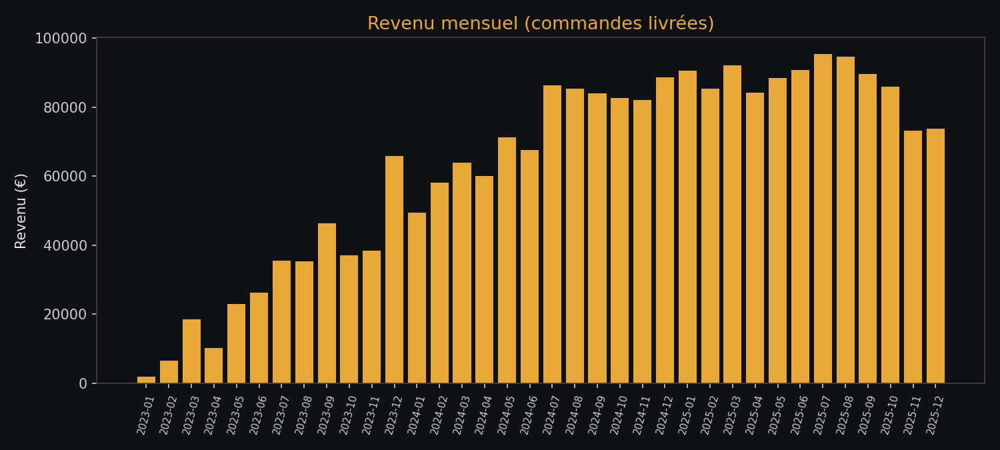
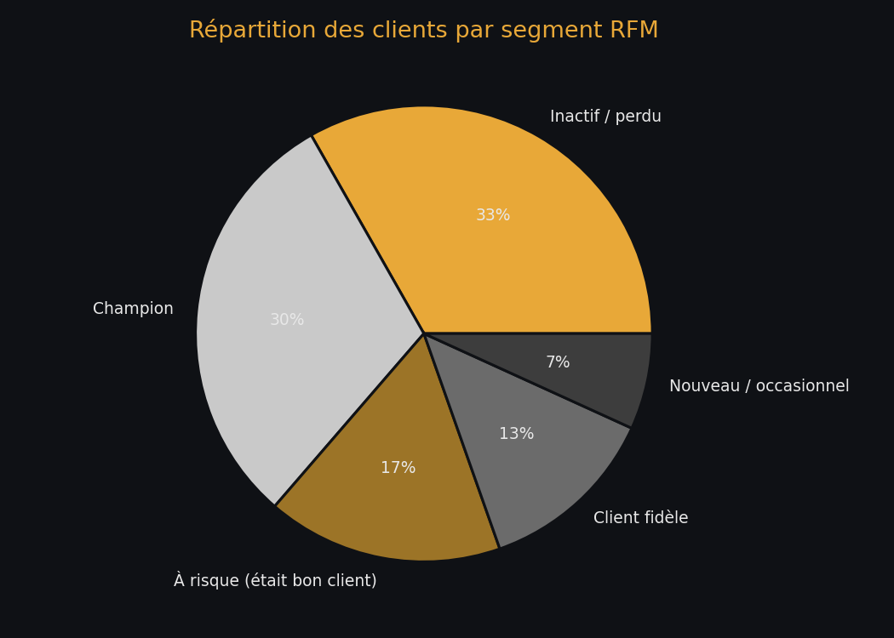
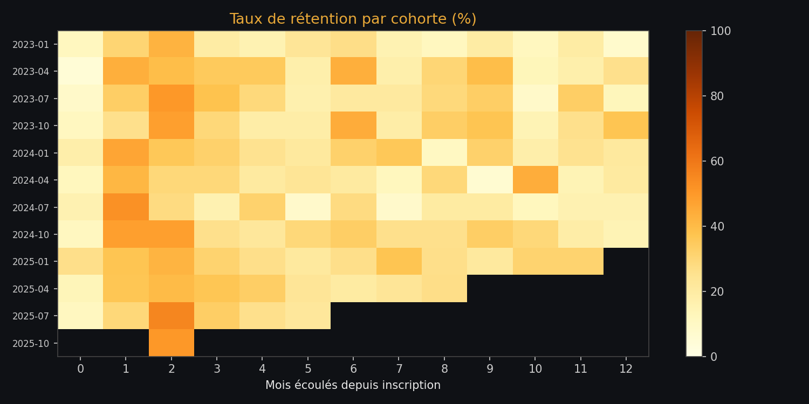

# 📊 Lumio Store — Analyse SQL avancée d'un e-commerce

> Projet d'analyse de données appliqué à un cas e-commerce fictif (**Lumio Store**), conçu pour démontrer une maîtrise du SQL analytique : window functions, CTE, segmentation client, analyse de cohortes et ABC analysis.

---

## 🎯 Contexte business

**Lumio Store** est une boutique e-commerce généraliste (8 catégories, 64 produits) qui vend en ligne depuis janvier 2023. Sur 3 ans, elle a acquis **900 clients** pour **4 168 commandes** et **2,27 M€** de chiffre d'affaires livré.

La direction se pose 5 questions concrètes :

1. Notre croissance ralentit-elle ?
2. Qui sont nos meilleurs clients, et qui est en train de partir ?
3. Nos clients reviennent-ils après leur inscription ?
4. Quels produits sont indispensables, et lesquels sont à déréférencer ?
5. Quel canal d'acquisition nous rapporte vraiment ?

Ce projet répond à ces questions avec **12 requêtes SQL avancées**, chacune adossée à une question business précise — pas de requête gratuite.

---

## 🗂️ Schéma de la base de données

```
categories                products                  customers
┌───────────────┐         ┌──────────────────┐      ┌────────────────────┐
│ category_id PK│◄────────│ category_id FK    │      │ customer_id      PK│
│ category_name │         │ product_id      PK│      │ first_name         │
└───────────────┘         │ product_name      │      │ last_name          │
                           │ unit_price        │      │ city               │
                           │ cost_price        │      │ signup_date        │
                           └──────────┬────────┘      │ acquisition_channel│
                                      │                └──────────┬──────────┘
                                      │                            │
                              order_items                      orders
                       ┌──────────────────────┐         ┌──────────────────┐
                       │ order_item_id      PK│         │ order_id       PK│
                       │ order_id           FK│◄────────│ customer_id    FK│
                       │ product_id         FK│         │ order_date        │
                       │ quantity              │         │ status            │
                       │ unit_price            │         └──────────────────┘
                       └──────────────────────┘
```

5 tables, modèle en étoile simplifié — volontairement proche de ce qu'on trouve dans une vraie base transactionnelle (Shopify, WooCommerce, ERP interne...).

---

## 🛠️ Stack & méthodologie

| Élément | Choix | Pourquoi |
|---|---|---|
| Base de données | SQLite | Zéro dépendance, portable, supporte les window functions modernes (RANK, NTILE, LAG, PERCENT_RANK) |
| Génération des données | Python (`generate_data.py`) | Données synthétiques mais avec des **profils comportementaux réalistes** (champions, clients fidèles, churnés...) pour que la segmentation RFM et l'analyse de cohortes aient du sens |
| Exécution & visualisation | Python + pandas + matplotlib (`run_analysis.py`) | Exporte chaque requête en CSV et génère les graphiques de ce README |
| Requêtes | SQL pur, un fichier par question business | Lisible, commenté, exécutable indépendamment dans n'importe quel client SQLite |

```bash
# Reproduire le projet en local
python3 generate_data.py     # génère database/ecommerce.db
python3 run_analysis.py      # exécute les 12 requêtes + génère les graphiques
```

---

## 📈 Les 12 analyses

### 1. Revenu mensuel & croissance MoM
**[`01_revenu_mensuel_croissance.sql`](sql/01_revenu_mensuel_croissance.sql)** — *CTE + `LAG()`*



**Insight :** le revenu mensuel est passé de ~2 000 € (janvier 2023) à un plateau de 85-95 000 € courant 2025. La croissance forte des 18 premiers mois (+ plusieurs pics à +100% MoM) s'essouffle nettement en 2025, avec même un léger repli en fin d'année (-15% en novembre). **Lumio Store change de phase : d'une logique d'acquisition pure à une logique de rétention.**

---

### 2. Segmentation RFM (Récence, Fréquence, Montant)
**[`02_segmentation_rfm.sql`](sql/02_segmentation_rfm.sql)** — *CTE multiples + `NTILE()` + `CASE`*



**Insight :** les **Champions** ne représentent que 30% de la base client mais génèrent **1,3 M€**, soit plus de la moitié du CA total. À l'inverse, le segment **"À risque"** (145 clients, anciens bons clients en train de décrocher) pèse encore 624 k€ de valeur historique — **c'est la priorité n°1 pour une campagne de réactivation ciblée.**

---

### 3. Analyse de cohortes (rétention)
**[`03_cohortes_retention.sql`](sql/03_cohortes_retention.sql)** — *CTE + arithmétique de dates*



**Insight :** quel que soit le mois d'inscription, la rétention chute fortement après le 2ᵉ mois et ne dépasse quasiment jamais 40% au-delà du 3ᵉ mois. **Le problème n'est pas l'acquisition, c'est l'activation post-achat** — une séquence d'emails ou une offre de relance à J+45 serait probablement plus rentable qu'une campagne d'acquisition supplémentaire.

---

### 4. Top 3 produits par catégorie
**[`04_top3_produits_categorie.sql`](sql/04_top3_produits_categorie.sql)** — *`RANK() OVER (PARTITION BY ...)`*

Identifie les produits stars de chacune des 8 catégories — utile pour la mise en avant homepage et la négociation fournisseurs.

---

### 5. Revenu cumulé par trimestre (running total)
**[`05_running_total_revenue.sql`](sql/05_running_total_revenue.sql)** — *`SUM() OVER (ORDER BY ... ROWS UNBOUNDED PRECEDING)`*

Permet de suivre la trajectoire de CA cumulé sur 3 ans face à un objectif — base classique de tout reporting de pilotage.

---

### 6. Classement des clients par valeur (LTV)
**[`06_classement_clients_valeur.sql`](sql/06_classement_clients_valeur.sql)** — *`DENSE_RANK()` + `PERCENT_RANK()`*

**Insight :** le test de Pareto se confirme côté clients aussi — une frange réduite de la base concentre une part disproportionnée de la valeur, ce qui justifie un programme VIP dédié plutôt qu'un traitement homogène de toute la base.

---

### 7. Taux de réachat & détection du churn
**[`07_taux_reachat_churn.sql`](sql/07_taux_reachat_churn.sql)** — *sous-requête corrélée + `CASE`*

| Statut | Clients | % de la base |
|---|---|---|
| One-shot (1 commande) | 307 | 34,1% |
| Récurrent mais churné (>6 mois inactif) | 284 | 31,6% |
| Récurrent actif | 276 | 30,7% |
| Jamais commandé | 33 | 3,7% |

**Insight :** **65,7% des clients qui ont déjà acheté ne sont plus actifs** (one-shot + churnés). C'est le chiffre le plus actionnable du projet : avant de dépenser plus en acquisition, Lumio Store devrait investir dans la rétention, où le ROI marginal est probablement supérieur.

---

### 8. Produits achetés ensemble (market basket)
**[`08_produits_achetes_ensemble.sql`](sql/08_produits_achetes_ensemble.sql)** — *self-join sur `order_items`*

Détecte les paires de produits qui reviennent souvent dans la même commande — base pour des recommandations "fréquemment achetés ensemble" ou des bundles.

---

### 9. Performance des canaux d'acquisition
**[`09_performance_canaux_acquisition.sql`](sql/09_performance_canaux_acquisition.sql)** — *agrégation multi-niveaux*

| Canal | Clients acquis | Valeur moy./client | Taux de réachat |
|---|---|---|---|
| Publicité Meta | 201 | 2 761 € | 61,7% |
| Email marketing | 109 | 2 325 € | **67,0%** |
| Réseaux sociaux | 79 | 2 651 € | 65,8% |
| Organique | 259 | 2 499 € | 59,1% |

**Insight :** l'email marketing acquiert peu de clients en volume mais affiche le **meilleur taux de réachat (67%)** — un signal que ce canal cible une audience déjà qualifiée. À l'inverse, le canal organique acquiert le plus de monde mais avec le taux de réachat le plus faible.

---

### 10. Panier moyen par trimestre + moyenne mobile
**[`10_panier_moyen_trimestre.sql`](sql/10_panier_moyen_trimestre.sql)** — *`AVG() OVER` fenêtre glissante*

Lisse les variations ponctuelles pour évaluer si Lumio Store monte en gamme (upsell) ou stagne sur la valeur moyenne du panier.

---

### 11. Clients en croissance d'une année sur l'autre
**[`11_clients_croissance_annuelle.sql`](sql/11_clients_croissance_annuelle.sql)** — *`LAG() OVER (PARTITION BY client)`*

Identifie les clients dont les dépenses augmentent (candidats à l'upsell) vs ceux qui diminuent (à relancer avant qu'ils ne partent).

---

### 12. Analyse ABC des produits (Pareto 80/20)
**[`12_analyse_abc_produits.sql`](sql/12_analyse_abc_produits.sql)** — *`SUM() OVER` cumulatif*

| Classe | Produits | Description |
|---|---|---|
| A | 34 / 64 | Génèrent 80% du CA — jamais en rupture de stock |
| B | 15 / 64 | CA intermédiaire (80-95%) |
| C | 15 / 64 | CA marginal (au-delà de 95%) — candidats au déréférencement |

---

## 💡 Synthèse pour la direction

Si je devais résumer ce projet en 3 recommandations actionnables :

1. **Investir dans la rétention avant l'acquisition** — 65,7% des acheteurs ne sont plus actifs, et la chute de rétention se joue dès le 2ᵉ-3ᵉ mois post-inscription.
2. **Cibler en priorité le segment "À risque"** (145 clients, 624 k€ de valeur historique) avec une campagne de réactivation, plutôt que de traiter toute la base de la même façon.
3. **Réallouer une partie du budget acquisition vers l'email marketing**, qui affiche le meilleur taux de réachat malgré un volume d'acquisition plus faible.

---

## ⚠️ Limites du projet

Les données sont **synthétiques** (générées avec des profils comportementaux volontairement réalistes), pas un vrai dataset client. L'objectif n'est pas de "découvrir" des insights authentiques mais de démontrer une **méthodologie SQL transposable** à une vraie base transactionnelle : mêmes requêtes, mêmes techniques, sur de la vraie donnée.

---

## 📁 Structure du repo

```
sql_ecommerce_project/
├── generate_data.py          # génère la base SQLite synthétique
├── run_analysis.py           # exécute les requêtes + génère les graphiques
├── database/ecommerce.db     # base SQLite (5 tables, ~10 400 lignes de détail)
├── sql/                      # les 12 requêtes, une par fichier, commentées
├── results/                  # exports CSV de chaque requête
├── charts/                   # visuels générés (PNG)
└── README.md
```

---

## 👤 Auteur

**Steeves Donald Nkounga** — Étudiant Bachelor 3 Data & IA (PST&B Paris)
📧 nkounga.donald@icloud.com · 🔗 [LinkedIn](https://linkedin.com/in/nkounga-donald) · 💼 [Portfolio](https://nkounga-donald12.github.io/Portfolio/)
